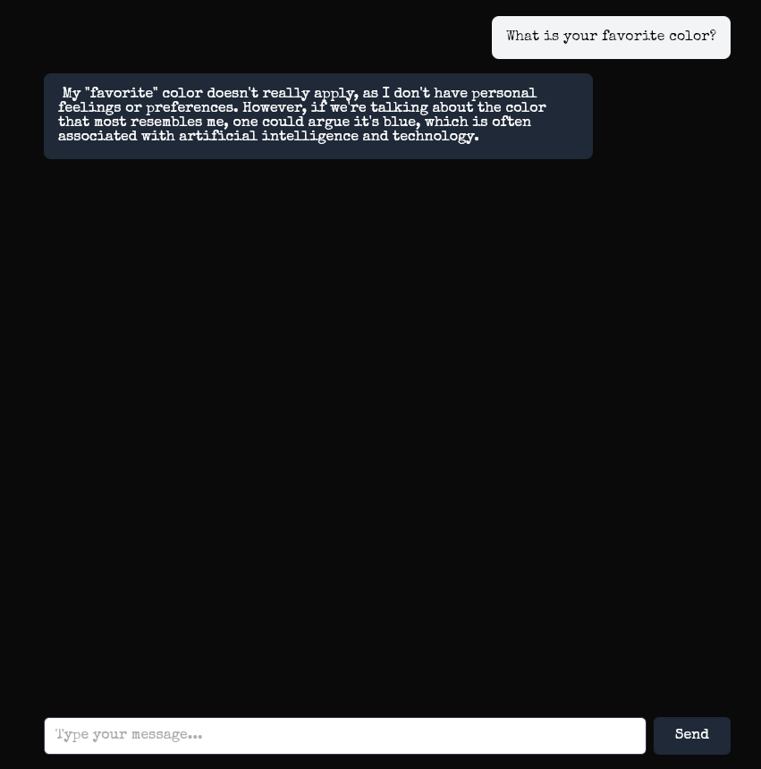

# pj

🎵 *Lift up the receiver, I'll make you a believer* 🎵

A fully offline, local-first Rust AI chat app. Everything runs on your machine — the model via Ollama, the web UI, and the CLI. No telemetry, no external API calls, no cloud dependencies. All static assets (fonts, etc.) are bundled locally.



## Quick Start

1. **Prerequisites**:
   - [Rust](https://rustup.rs/) (1.75 or newer)
   - [Ollama](https://ollama.ai/) installed locally

2. **Pull the model**:
   ```bash
   ollama pull gemma2:9b
   ```

3. **Set environment variables**:
   ```bash
   export OLLAMA_URL=http://localhost:11434
   export MODEL_NAME=gemma2:9b
   export PORT=8080
   ```

4. **Run the application**:
   ```bash
   cargo run --release
   ```

5. **Access the app**:
   Open your browser to [http://localhost:8080](http://localhost:8080)

## CLI Tool

A command-line interface is available for chatting from the terminal:

```bash
# One-shot: ask a question and get a response
./target/release/pj "What is the capital of France?"

# Default interactive mode
./target/release/pj

# Plain terminal mode
./target/release/pj --plain

# Force fullscreen TUI mode
./target/release/pj --tui
```

To use `pj` from anywhere, add this alias to your `~/.bashrc` (make sure `DATABASE_URL` points to the project's database so the CLI and web app share the same data):

```bash
alias pj='DATABASE_URL=/path/to/pj/data/chat.db /path/to/pj/target/release/pj'
```

The CLI shares the same SQLite database as the web app, so conversations are synced between both interfaces. If `DATABASE_URL` is not set, both binaries now default to the project database at `/home/whiterabbit/CodingStuff/area51/aiMagic/personalJesus/data/chat.db` instead of using a cwd-relative path.

## Unicode and CJK Text

Chat content is stored in SQLite as UTF-8. If Chinese text looks wrong, the failure is usually in the rendering surface:

- Web UI: the bundled `Special Elite` font only covers Latin text, so Chinese glyphs must come from an installed fallback font such as `Noto Sans CJK SC`, `PingFang SC`, or `Microsoft YaHei`.
- Web UI: the app now bundles a local `Noto Sans CJK SC` font for Chinese text, so browser rendering does not depend on host font packages.
- CLI/TUI: your terminal emulator must use a font with CJK glyph coverage and a UTF-8 locale such as `en_US.UTF-8`.
- Use `pj --plain` if the fullscreen TUI is a poor fit for your terminal setup or font rendering.
- If the CLI still shows boxes for Chinese text, install a CJK font for your terminal environment and fully restart the terminal emulator so it reloads font fallback data. On this machine, installing `Noto Sans CJK SC` into `~/.local/share/fonts` and restarting `kitty` was required.

You can verify the stored content directly with:

```bash
sqlite3 data/chat.db "select role, content from messages order by id desc limit 5;"
```

## Contributing

Feel free to open issues or submit pull requests!

## License

MIT

## Credits

- Built with [Actix-web](https://actix.rs/)
- Powered by [Ollama](https://ollama.ai/)
