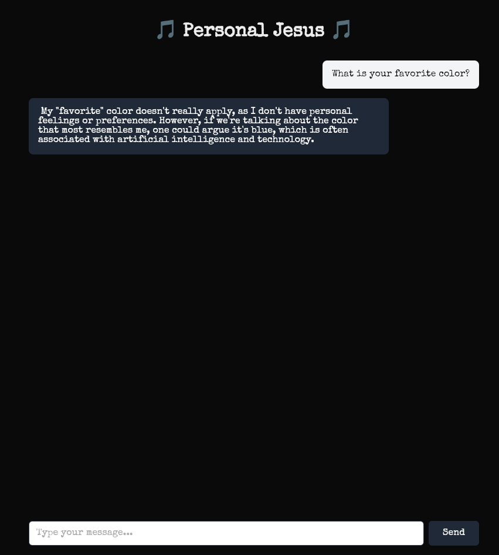

# Personal Jesus 🎵

*Lift up the receiver, I'll make you a believer* 🎵

A Rust implementation of a web app to interact with AI model.



## Quick Start

### Using Docker Compose (Recommended)

1. **Prerequisites**:
   - [Docker](https://docs.docker.com/get-docker/)
   - [Docker Compose](https://docs.docker.com/compose/install/)

2. **Run the application**:
   ```bash
   docker-compose up
   ```

   The first time you run this, it will:
   - Pull the Ollama image
   - Pull the model
   - Build the Rust application
   - Start everything up

3. **Access the app**:
   Open your browser to [http://localhost:8080](http://localhost:8080)

4. **Stop the application**:
   ```bash
   docker-compose down
   ```

   To also remove the model data:
   ```bash
   docker-compose down -v
   ```

### Local Development (Without Docker)

If you want to run it locally for development:

1. **Prerequisites**:
   - [Rust](https://rustup.rs/) (1.75 or newer)
   - [Ollama](https://ollama.ai/) installed locally

2. **Pull the model**:
   ```bash
   ollama pull [modelnamehere]
   ```

3. **Set environment variables**:
   ```bash
   export OLLAMA_URL=http://localhost:11434
   export MODEL_NAME=[yourpreferredmodel]
   export PORT=8080
   ```

4. **Run the application**:
   ```bash
   cargo run --release
   ```

5. **Access the app**:
   Open your browser to [http://localhost:8080](http://localhost:8080)

## Contributing

Feel free to open issues or submit pull requests!

## License

MIT

## Credits

- Built with [Actix-web](https://actix.rs/)
- Powered by [Ollama](https://ollama.ai/)
